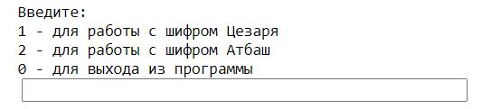

---
# Front matter
title: "Математические основы защиты информации и информационной безопасности. Лабораторная работа №1."
subtitle: "Шифры простой замены"
author: "Студент: Масолова Анна Олеговна, НФИмд-02-21"

# Generic otions
lang: ru-RU
toc-title: "Содержание"

# Bibliography
bibliography: bib/cite.bib
csl: pandoc/csl/gost-r-7-0-5-2008-numeric.csl

# Pdf output format
toc: true # Table of contents
toc_depth: 2
lof: true # List of figures
lot: true # List of tables
fontsize: 12pt
linestretch: 1.5
papersize: a4
documentclass: scrreprt
## I18n
polyglossia-lang:
  name: russian
  options:
	- spelling=modern
	- babelshorthands=true
polyglossia-otherlangs:
  name: english
### Fonts
mainfont: PT Serif
romanfont: PT Serif
sansfont: PT Sans
monofont: PT Mono
mainfontoptions: Ligatures=TeX
romanfontoptions: Ligatures=TeX
sansfontoptions: Ligatures=TeX,Scale=MatchLowercase
monofontoptions: Scale=MatchLowercase,Scale=0.9
## Biblatex
biblatex: true
biblio-style: "gost-numeric"
biblatexoptions:
  - parentracker=true
  - backend=biber
  - hyperref=auto
  - language=auto
  - autolang=other*
  - citestyle=gost-numeric
## Misc options
indent: true
header-includes:
  - \linepenalty=10 # the penalty added to the badness of each line within a paragraph (no associated penalty node) Increasing the value makes tex try to have fewer lines in the paragraph.
  - \interlinepenalty=0 # value of the penalty (node) added after each line of a paragraph.
  - \hyphenpenalty=50 # the penalty for line breaking at an automatically inserted hyphen
  - \exhyphenpenalty=50 # the penalty for line breaking at an explicit hyphen
  - \binoppenalty=700 # the penalty for breaking a line at a binary operator
  - \relpenalty=500 # the penalty for breaking a line at a relation
  - \clubpenalty=150 # extra penalty for breaking after first line of a paragraph
  - \widowpenalty=150 # extra penalty for breaking before last line of a paragraph
  - \displaywidowpenalty=50 # extra penalty for breaking before last line before a display math
  - \brokenpenalty=100 # extra penalty for page breaking after a hyphenated line
  - \predisplaypenalty=10000 # penalty for breaking before a display
  - \postdisplaypenalty=0 # penalty for breaking after a display
  - \floatingpenalty = 20000 # penalty for splitting an insertion (can only be split footnote in standard LaTeX)
  - \raggedbottom # or \flushbottom
  - \usepackage{float} # keep figures where there are in the text
  - \floatplacement{figure}{H} # keep figures where there are in the text
---

# Цель работы

Познакомиться с шифрами простой замены и реализовать шифры Цезаря и Атбаш.

# Задание

1. Реализовать шифр Цезаря с произвольным ключом k;
2. Реализовать шифр Атбаш.

# Теоретическое введение

Шифры простой замены --- это наиболее часто используемые шифры. Они характеризуются тем, что какие-либо отдельные символы исходного текста заменяются другими символами. При этом замена осуществляется так, чтобы при расшифровке шифрограммы можно было однозначно восстановить исходное сообщение.

## Шифр Цезаря

Данный шифр замены позволяет зашифровать сообщение путем сдвига каждого символа сообщения на произвольный ключ `j`. Таким образом, можно вывести соотношение:

$$ T_{m}= {T^{j}}, j = 0,1, ... , m - 1, $$
$$ {T^{j}(a)} = (a + j) mod \ m, $$

где $(a+j) mod \ m$ -- операция нахождения остатка от целочисленного деления $a+j$ на $m$, $T_{m}$ -- циклическая подгруппа.

## Шифр Атбаш

Данный шифр является шифром сдвига на всю длину алфавита:
$$ m − n + 1, $$
где $m$ -- число букв в алфавите, $n$ -- порядковый номер заданного символа.  

Более подробно о шифрах см. в [@atbash;@caesar].


# Выполнение лабораторной работы

В рамках данной лабораторной работы были описаны алгоритмы двух типов шифрования.  
Для программной реализации шифров были использованы таблица ASCII и функции работы с ней (`ord` и `chr`).  
Сначала были заданы константы: порядковый номер первого и последнего символов в таблице ASCII, количество символов в алфавите и игнорируемые символы. Для реализации шифра Цезаря была создана функция `caesar(message, shift, code)`, которая в качестве аргументов получает сообщение, ключ и действие, которое необходимо выполнить (шифрование или дешифрование). Для реализации шифра Атбаш создана функция `atbash(message, code)`, в качестве аргументов она получает сообщение и действие -- шифрование или дешифрование. Также было реализовано консольное меню для улучшения взаимодействия с пользователем.  

Более подробно о таблице ASCII и методах работы с ней см. в [@ascii;@pythonim].


## Листинг
```
FIRST_SYMBOL_ASCII = 97
LAST_SYMBOL_ASCII = 122
alphabet = 26
IGNORE_SYMBOLS = " 1234567890.,?!-=:;*+[]{}<>^"

def caesar(message, shift, code):
    new_message = ""
    for symbol in message:
        if symbol in IGNORE_SYMBOLS:
            new_message += symbol
            continue
        if (code == 1):
            new_symbol = chr(FIRST_SYMBOL_ASCII + ((ord(symbol) - FIRST_SYMBOL_ASCII + shift) % alphabet))
        else:
            new_symbol = chr(FIRST_SYMBOL_ASCII + ((ord(symbol) - FIRST_SYMBOL_ASCII - shift) % alphabet))
        new_message += new_symbol
    return new_message

def atbash(message, code):
    new_message = ""
    for symbol in message:
        if symbol in IGNORE_SYMBOLS:
            new_message += symbol
            continue
        if (code == 1):
            new_symbol = chr(FIRST_SYMBOL_ASCII + LAST_SYMBOL_ASCII - ord(symbol))
        else:
            new_symbol = chr(FIRST_SYMBOL_ASCII - ord(symbol) + LAST_SYMBOL_ASCII)
        new_message += new_symbol
    return new_message

while(True):
    code = int(input("\nВведите:\n1 - для работы с шифром Цезаря\n2 - для работы с шифром Атбаш\n0 - для выхода из программы\n"))
    if (code == 1):
        code1 = int(input("\nВведите:\n1 - для зашифровки сообщения\n2 - для дешифровки сообщения\n"))
        message = input("Введите сообщение: ")
        shift = int(input("Задайте сдвиг от 1 до 25: "))
        if (code1 == 1):
            result = caesar(message, shift, 1)
            print("\nШифр Цезаря\nЗашифрованное сообщение:\n{}".format(result))
        else:
            result = caesar(message, shift, 2)
            print("\nШифр Цезаря\nРасшифрованное сообщение:\n{}".format(result))
    elif (code == 2):
        code1 = int(input("\nВведите:\n1 - для зашифровки сообщения\n2 - для дешифровки сообщения\n"))
        message = input("Введите сообщение: ")
        if (code1 == 1):
            result = atbash(message, 1)
            print("\nШифр Атбаш\nЗашифрованное сообщение:\n{}".format(result))
        else:
            result = atbash(message, 2)
            print("\nШифр Атбаш\nРасшифрованное сообщение:\n{}".format(result))
    elif (code == 0):
        break
    else:
        print("Ошибка ввода")
    
```

## Полученные результаты

В результате выполнения программы пользователю предлагается выбрать действие (рис. [-@fig:001]).

{ #fig:001 width=70% }

Если пользователь хочет использовать шифр Цезаря, то необходимо ввести "1". Если нужно зашифровать сообщение, то вводится "1", если дешифровать -- "2". Затем пользователю предлагается ввести сообщение и ключ. Результат выполнения программы представлен на рис [-@fig:002].

{ #fig:002 width=70% }

Для использования шифра Атбаш, нужно ввести "2". Если нужно зашифровать сообщение, то вводится "1", если дешифровать -- "2". Затем пользователь вводит сообщение. Результат выполнения программы представлен на рис. [-@fig:003].

{ #fig:003 width=70% }

Для выхода из программы нужно ввести "0".

# Выводы

Таким образом, в рамках данной лабораторной работы я познакомилась с шифрами простой замены и реализовала шифры Цезаря и Атбаш.

# Список литературы{.unnumbered}

::: {#refs}
:::
