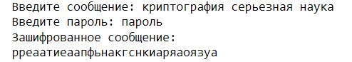

---
## Front matter
lang: ru-RU
title: "Математические основы защиты информации и информационной безопасности. Лабораторная работа №2. Шифры перестановки"
author: |
 Масолова Анна Олеговна, учебная группа: НФИмд-02-21  
 Преподаватель: Кулябов Дмитрий Сергеевич
institute: Российский Университет Дружбы Народов
date: 20 ноября, 2021, Москва, Россия

## Formatting
mainfont: PT Serif
romanfont: PT Serif
sansfont: PT Sans
monofont: PT Mono
toc: false
slide_level: 2
theme: metropolis
header-includes: 
 - \metroset{progressbar=frametitle,sectionpage=progressbar,numbering=fraction}
 - '\makeatletter'
 - '\beamer@ignorenonframefalse'
 - '\makeatother'
aspectratio: 43
section-titles: true

---

# Цели и задачи

## Цель лабораторной работы

Ознакомиться с шифрами перестановки на примере маршрутного шифрования, шифрования с помощью решеток и таблицы Виженера.

## Задачи лабораторной работы 

1. Реализовать маршрутное шифрование;
2. Реализовать шифрование с помощью решеток;
3. Реализовать шифрование с помощью таблицы Виженера.

# Выполнение лабораторной работы

## Шифры перестановки

Шифр перестановки — это метод симметричного шифрования, в котором элементы исходного открытого текста меняют местами. Элементами текста могут быть отдельные символы (самый распространённый случай), пары букв, тройки букв, комбинирование этих случаев и так далее.

## Маршрутное шифрование

При шифровании в таблицу вписывают исходное сообщение по определенному маршруту, а выписывают (получают шифрограмму) – по другому. Для данного шифра маршруты вписывания и выписывания, а также размеры таблицы являются ключом.
В рамках работы данного алгоритма шифрования задаются две переменные: `m` - количество столбцов таблицы, которое равно длине ключа и `n` - количество строк в таблице.  
Для случая, когда в сообщении недостаточно букв для того, чтобы заполнить всю таблицу, предусмотрено добавление случайных букв в конец сообщения.  

## Маршрутное шифрование

В результате отработки алгоритма возвращаются отсортированные столбцы таблицы в алфавитном порядке букв ключа. На рис. [-@fig:1] ключом является `пароль`, соответственно в результирующее сообщение сначала записывается столбец под буквой `a` ключа, и заканчивается столбцом под `ь`.

## Маршрутное шифрование

{ #fig:1 width=50% }  

## Шифрование с помощью решеток

Поворотная решетка — это прямоугольная или квадратная карточка с четным числом строк и столбцов `2k X 2k`. В ней проделаны отверстия таким образом, что при последовательном отражении или поворачивании и заполнении открытых клеток карточки постепенно будут заполнены все клетки листа.  
Карточку сначала отражают относительно вертикальной оси симметрии, затем - относительно горизонтальной оси, и снова - относительно вертикальной. На рис. [-@fig:2] изображена последовательность поворота решетки для заполнения её буквами сообщения:  

## Шифрование с помощью решеток

{ #fig:2 width=60% }  

## Шифрование с помощью решеток

В итоге, когда таблица заполнена, как и в предыдущем алгоритме столбцы решетки сортируются в алфавитном порядке букв ключа.

## Таблица Виженера

Шифр Виженера состоит из последовательности нескольких шифров Цезаря с различными значениями сдвига. Для зашифровывания может использоваться таблица алфавитов, называемая `tabula recta` или таблица Виженера. Применительно к латинскому алфавиту таблица Виженера составляется из строк по 26 символов, причём каждая следующая строка сдвигается на несколько позиций. Таким образом, в таблице получается 26 различных шифров Цезаря. На каждом этапе шифрования используются различные алфавиты, выбираемые в зависимости от символа ключевого слова.  

## Таблица Виженера

Например, предположим, что исходный текст имеет такой вид:

$$ATTACKATDAWN$$
Человек, посылающий сообщение, записывает ключевое слово («LEMON») циклически до тех пор, пока его длина не будет соответствовать длине исходного текста:

$$LEMONLEMONLE$$

## Таблица Виженера

Если $n$  — количество букв в алфавите, $m_{j}$ — номер буквы открытого текста, $k_{j}$ — номер буквы ключа в алфавите, то шифрование Виженера можно записать следующим образом:
$$ c_{j}=(m_{j}+k_{j})\mod {n}$$  
Пример таблицы виженера для латинского алфавита изображен на рис. [-@fig:3]:  

## Таблица Виженера

{ #fig:3 width=70% }  

## Таблица Виженера

В итоге, когда таблица заполнена, как и в предыдущем алгоритме столбцы решетки сортируются в алфавитном порядке букв ключа.

# Полученные результаты

## Результаты маршрутного шифрования

{ #fig:4 width=70% }

## Результаты шифрования с помощью решеток

{ #fig:5 width=100% }

## Результаты шифрования с помощью таблицы Виженера

{ #fig:6 width=70% }

# Выводы

## Результаты выполнения лабораторной работы

В ходе выполнения данной лабораторной работы было выполнено ознакомление с шифрами перестановки на примере маршрутного шифрования, шифрования с помощью решеток и таблицы Виженера.  
В результате проделанной работы были программно реализованы эти методы шифрования.  
В итоге поставленные цели и задачи были успешно достигнуты.