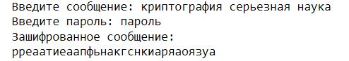

---
# Front matter
title: "Математические основы защиты информации и информационной безопасности. Лабораторная работа №2."
subtitle: "Шифры перестановки"
author: |
 Студент: Масолова Анна Олеговна НФИмд-02-21  
 Преподаватель: Кулябов Дмитрий Сергеевич

# Generic otions
lang: ru-RU
toc-title: "Содержание"

# Bibliography
bibliography: bib/cite.bib
csl: pandoc/csl/gost-r-7-0-5-2008-numeric.csl

# Pdf output format
toc: true # Table of contents
toc_depth: 2
lof: true # List of figures
lot: true # List of tables
fontsize: 12pt
linestretch: 1.5
papersize: a4
documentclass: scrreprt
## I18n
polyglossia-lang:
  name: russian
  options:
	- spelling=modern
	- babelshorthands=true
polyglossia-otherlangs:
  name: english
### Fonts
mainfont: PT Serif
romanfont: PT Serif
sansfont: PT Sans
monofont: PT Mono
mainfontoptions: Ligatures=TeX
romanfontoptions: Ligatures=TeX
sansfontoptions: Ligatures=TeX,Scale=MatchLowercase
monofontoptions: Scale=MatchLowercase,Scale=0.9
## Biblatex
biblatex: true
biblio-style: "gost-numeric"
biblatexoptions:
  - parentracker=true
  - backend=biber
  - hyperref=auto
  - language=auto
  - autolang=other*
  - citestyle=gost-numeric
## Misc options
indent: true
header-includes:
  - \linepenalty=10 # the penalty added to the badness of each line within a paragraph (no associated penalty node) Increasing the value makes tex try to have fewer lines in the paragraph.
  - \interlinepenalty=0 # value of the penalty (node) added after each line of a paragraph.
  - \hyphenpenalty=50 # the penalty for line breaking at an automatically inserted hyphen
  - \exhyphenpenalty=50 # the penalty for line breaking at an explicit hyphen
  - \binoppenalty=700 # the penalty for breaking a line at a binary operator
  - \relpenalty=500 # the penalty for breaking a line at a relation
  - \clubpenalty=150 # extra penalty for breaking after first line of a paragraph
  - \widowpenalty=150 # extra penalty for breaking before last line of a paragraph
  - \displaywidowpenalty=50 # extra penalty for breaking before last line before a display math
  - \brokenpenalty=100 # extra penalty for page breaking after a hyphenated line
  - \predisplaypenalty=10000 # penalty for breaking before a display
  - \postdisplaypenalty=0 # penalty for breaking after a display
  - \floatingpenalty = 20000 # penalty for splitting an insertion (can only be split footnote in standard LaTeX)
  - \raggedbottom # or \flushbottom
  - \usepackage{float} # keep figures where there are in the text
  - \floatplacement{figure}{H} # keep figures where there are in the text
---

# Цель работы

Познакомиться с шифрами перестановки на примере маршрутного шифрования, шифрования с помощью решеток и таблицы Виженера.

# Задание

1. Реализовать маршрутное шифрование;
2. Реализовать шифрование с помощью решеток;
3. Реализовать таблицу Виженера.

# Теоретическое введение

Шифр перестановки — это метод симметричного шифрования, в котором элементы исходного открытого текста меняют местами. Элементами текста могут быть отдельные символы (самый распространённый случай), пары букв, тройки букв, комбинирование этих случаев и так далее. Типичными примерами перестановки являются анаграммы. В классической криптографии шифры перестановки можно разделить на три класса:

## Маршрутное шифрование

При шифровании в такую таблицу вписывают исходное сообщение по определенному маршруту, а выписывают (получают шифрограмму) – по другому. Для данного шифра маршруты вписывания и выписывания, а также размеры таблицы являются ключом [@marshrut].  
В рамках работы данного алгоритма шифрования задаются две переменные: `m` - количество столбцов таблицы, которое равно длине ключа и `n` - количество строк в таблице.  
Для случая, когда в сообщении недостаточно букв для того, чтобы заполнить всю таблицу, предусмотрено добавление случайных букв в конец сообщения.  

{ #fig:1 width=70% }  

В результате отработки алгоритма возвращаются отсортированные столбцы таблицы по алфавитному порядку букв ключа. На рис. [-@fig:1] ключом является `пароль`, соответственно в результирующее сообщение сначала записывается столбец под буквой `a` ключа, и заканчивается столбцом под `ь`.

## Шифрование с помощью решеток

Поворотная решетка — это прямоугольная или квадратная карточка с четным числом строк и столбцов `2k X 2k`. В ней проделаны отверстия таким образом, что при последовательном отражении или поворачивании и заполнении открытых клеток карточки постепенно будут заполнены все клетки листа.  
Карточку сначала отражают относительно вертикальной оси симметрии, затем - относительно горизонтальной оси, и снова - относительно вертикальной [@reshetka]. На рисунке [-@fig:2]изображена последовательность поворота решетки для заполнения её буквами сообщения:  

{ #fig:2 width=70% }  

По итогу, когда таблица заполнена, как и в предыдущем алгоритме столбцы решетки сортируются в алфавитном порядке букв ключа.

## Таблица Виженера

Шифр Виженера состоит из последовательности нескольких шифров Цезаря с различными значениями сдвига. Для зашифровывания может использоваться таблица алфавитов, называемая `tabula recta` или таблица Виженера. Применительно к латинскому алфавиту таблица Виженера составляется из строк по 26 символов, причём каждая следующая строка сдвигается на несколько позиций. Таким образом, в таблице получается 26 различных шифров Цезаря. На каждом этапе шифрования используются различные алфавиты, выбираемые в зависимости от символа ключевого слова. Например, предположим, что исходный текст имеет такой вид:

$$ATTACKATDAWN$$
Человек, посылающий сообщение, записывает ключевое слово («LEMON») циклически до тех пор, пока его длина не будет соответствовать длине исходного текста:

$$LEMONLEMONLE$$
Если $n$  — количество букв в алфавите, $m_{j}$ — номер буквы открытого текста, $k_{j}$ — номер буквы ключа в алфавите, то шифрование Виженера можно записать следующим образом:
$$ c_{j}=(m_{j}+k_{j})\mod {n}$$  
Пример таблицы виженера для латинского алфавита изображен на рис. [-@fig:3]:  

{ #fig:3 width=70% }  

Более подробно о шифре Вижинера: [@visioner].

# Выполнение лабораторной работы

В рамках данной лабораторной работы были описаны алгоритмы трех типов шифрования.  

## Описание реализации методов

### Описание реализации маршрутного шифрования
Для реализации данного шифрования были описаны 4 метода: `get_nm(message, password)` для расчета размеров `n` и `m` матрицы, `message_to_dict(message, m, n)` для записи сообщения в таблицу, представленную python словарем с ключами букв пароля, `sort_dict(dict)` для сортировки словаря по ключу и метод преобразования словаря в зашифрованное собщение `dict_to_string(dict)`.

### Описание реализации шифрования с помощью решеток
Для реализации данного шифрования были описаны пять новых методов: `count_k(message)` для расчета размерности матрицы `k`, `init_list(k)` для создания первичной таблицы размерности `k`, `rotate_list(list)` для поворота таблицы, `init_big_table(list)` для инициализации большой таблицы и метод освобождения и заполнения свободных ячеек буквами сообщения `open_spaces(list, message)`.

### Описание реализации шифрования с помощью таблицы Виженера
Для реализации данного шифрования были описаны три метода: `create_table(alphabet)` для создания таблицы виженера, `make_password(message, password)` для формирования пароля длиной равной длине сообщения и `visioner(message, password, table)` для шифрования сообщения.

## Листинг

Код приведенных ниже программ реализован на языке python.

### Маршрутное шифрование
```
from _collections import OrderedDict

def get_nm(message, password):
    n = len(password)
    result = len(message) / len(password)
    while True:
        if int(result) != result:
            message += 'a'
            result = len(message) / len(password)
        else:
            break
    m = int(result)
    return n, m, message


def message_to_dict(message, m, n):
    message_dict = {}
    for i in range(n):
        temp_message = []
        for j in range(m):
            temp_message.append(message[i + j * n])
        message_dict[password[i]] = temp_message
    return message_dict


def sort_dict(dict):
    return OrderedDict(sorted(dict.items()))


def dict_to_string(dict):
    new_message = ''
    for keys in dict:
        for key in keys:
            new_message += "".join(dict[key])
    return new_message


message = input("Введите сообщение: ").replace(" ", "")
password = input("Введите пароль: ")
n, m, message = get_nm(message, password)
dict_message = message_to_dict(message, m, n)
ordered_dict_message = sort_dict(dict_message)
print("Зашифрованное сообщение: ")
print(dict_to_string(ordered_dict_message))
```


### Шифрование с помощью решеток
```
from _collections import OrderedDict
import math
import random

def count_k(message):
    k = int(math.ceil((math.sqrt(len(message)) / 2)))
    while True:
        if len(message) == ((2 * k)**2):
            break
        else:
            message += random.choice('йцукенгшщзхъфывапролджэячсмитьбю')
    return k, message

def init_list(k):
    list_to_init = []
    counter = 0
    for i in range(k):
        temp_list = []
        for j in range(k):
            counter += 1
            temp_list.append(counter)
        list_to_init.append(temp_list)
    return list_to_init

def rotate_list(list):
    new_list = []
    for i, row in enumerate(list):
        temp_row_list = []
        for j, col in enumerate(row):
            temp_row_list.append(list[len(list) - j - 1][i])
        new_list.append(temp_row_list)
    return new_list

def init_big_table(list):
    not_rotated_list = list
    result_list = []
    rotated_list1 = rotate_list(not_rotated_list)
    rotated_list2 = rotate_list(rotated_list1)
    rotated_list3 = rotate_list(rotated_list2)
    for ix, item in enumerate(rotated_list1):
        temp_row = not_rotated_list[ix] + rotated_list1[ix]
        result_list.append(temp_row)
    for ix, item in enumerate(rotated_list2):
        temp_row = rotated_list3[ix] + rotated_list2[ix]
        result_list.append(temp_row)
    return result_list

def open_spaces(list, message):
    message_letters_left = message
    spaces = k**2
    i = 1
    while True:
        if i == spaces + 1:
            break
        rand_index_i = random.randint(0, (k * 2) - 1)
        rand_index_j = random.randint(0, (k * 2) - 1)
        if list[rand_index_i][rand_index_j] == i:
            list[rand_index_i][rand_index_j] = message_letters_left[0]
            message_letters_left = message_letters_left[1:]
            i += 1
    return message_letters_left
    
def sorted_to_string(res, password):
    res_dict = dict(zip(password, res))
    print("Зашифрованное сообщение в виде словаря до сортировки: ")
    print(res_dict)
    sorted_dict = sort_dict(res_dict)
    print("Зашифрованное сообщение в виде словаря после сортировки: ")
    print(sorted_dict)
    string_message = dict_to_string(sorted_dict)
    return string_message
    
def sort_dict(dict):
    return OrderedDict(sorted(dict.items()))


def dict_to_string(dict):
    new_message = ''
    for keys in dict:
        for key in keys:
            new_message += "".join(dict[key])
    return new_message


message = input("Введите сообщение: ").replace(' ', '')

k, message = count_k(message)

print("Сообщение с учетом добавления произвольных символов: ")
print(message)

inited = init_list(k)

print("Исходная матрица: ")
print(*inited, sep="\n")

res = init_big_table(inited)
print("Образованная большая таблица k*2: ")
print(*res, sep="\n")
sliced_message = open_spaces(res, message)

res = rotate_list(res)
sliced_message = open_spaces(res, sliced_message)

res = rotate_list(res)
sliced_message = open_spaces(res, sliced_message)

res = rotate_list(res)
sliced_message = open_spaces(res, sliced_message)
print("Зашифрованное сообщение в списковом представлении: ")
print(*res, sep="\n", end="\n\n")

password = input("Введите ключ (длина ключа = {}): ".format(len(res)))
result = sorted_to_string(res, password)
print("\n\nЗашифрованное сообщение: ")
print(result)
```

### Таблица Виженера
```
def make_password(message, password):
    new_password = ''
    for ix, item in enumerate(message):
        new_password += password[ix % len(password)]
    print(new_password)
    return new_password

alphabet = 'абвгдежзийклмнопрстуфхцчшщъыьэюя'

def create_table(alphabet):
    alphabet_list = []
    current_row = alphabet
    alphabet_list.append(current_row)
    for item in alphabet:
        current_row = current_row[1:] + current_row[0]
        alphabet_list.append(current_row)
    alphabet_list.pop()
    return alphabet_list
    
def visioner(message, password, table):
    indexes_i = []
    res_string = ''
    for ix, letter in enumerate(message):
        index_i = table[0].find(letter)
        indexes_i.append(index_i)
    indexes_j = []
    for ix, letter in enumerate(password):
        index_j = table[0].find(letter)
        indexes_j.append(index_j)
    for i, row in enumerate(indexes_i):
        res_string += table[indexes_i[i]][indexes_j[i]]
    return res_string
    

message = input("Введите сообщение: ").replace(' ', '')
print("Форматированное сообщение: ")
print(message)
print()
password = input("Введите пароль (не превышающий длину сообщения): ")
print("Дополненный пароль до длины сообщения: ")
password = make_password(message, password)
table = create_table(alphabet)
print("\nТаблица: ")
print(*table[0:3], sep='\n')
print("...")
print("...")
print(*table[-3:], sep='\n')
result = visioner(message, password, table)
print("\nЗашифрованное сообщение: ")
print(result)
    
```

## Полученные результаты

### Маршрутное шифрование

При запуске программы пользователю предлагается ввести сообщение, которое необходимо зашифровать, и ключ. В результате выполнения пользователь получает зашифрованное сообщение (рис. [-@fig:4]).

{ #fig:4 width=70% }

### Шифрование с помощью решеток

Пользователь вводит сообщение, которое необходимо зашифровать. В конец сообщения добавляются произвольные символы (если это необходимо), затем выводится матрица размерности `k`. Полученная матрица поворачивается на $90^{\circ}$ и присоединяется к исходной справа. Данная операция повторяется дважды, и полученные матрицы приписываются снизу. Пользователю показывается полученная большая матрица размерности `2k`. Затем выводится зашифрованное сообщение в списковом представлении. После этого пользователю предлагается ввести ключ. Выводится зашифрованное сообщение в виде словаря до сортировки, затем происходит сортировка и выводятся результаты сортировки. В итоге пользователь получает зашифрованное сообщение (рис. [-@fig:5]).

{ #fig:5 width=100% }

### Таблица Виженера

При запуске программы пользователю предлагается ввести сообщение, которое необходимо зашифровать. Из сообщения удаляются пробелы и выводится форматированное сообщение. Затем пользователь вводит ключ, который не должен превышать длину самого сообщения. Ключ дополянется до длины сообщения и демонстрируется пользователю. После этого строится таблица Виженера. В итоге пользователь получается зашифрованное сообщение (на рис. [-@fig:6]).

{ #fig:6 width=100% }


# Выводы

В ходе выполнения данной лабораторной работы было выполнено ознакомление с шифрами перестановки на примере маршрутного шифрования, шифрования с помощью решеток и таблицы Виженера.  
В результате проделанной работы были программно реализованы эти методы шифрования.  
В итоге поставленные цели и задачи были успешно достигнуты.

# Список литературы{.unnumbered}

::: {#refs}
:::
