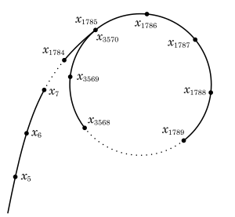

---
## Front matter
lang: ru-RU
title: "Математические основы защиты информации и информационной безопасности. Лабораторная работа №6. Разложение чисел на множители"
author: |
 Масолова Анна Олеговна, учебная группа: НФИмд-02-21  
 Преподаватель: Кулябов Дмитрий Сергеевич
institute: Российский Университет Дружбы Народов
date: 17 декабря, 2021, Москва, Россия

## Formatting
mainfont: PT Serif
romanfont: PT Serif
sansfont: PT Sans
monofont: PT Mono
toc: false
slide_level: 2
theme: metropolis
header-includes: 
 - \metroset{progressbar=frametitle,sectionpage=progressbar,numbering=fraction}
 - '\makeatletter'
 - '\beamer@ignorenonframefalse'
 - '\makeatother'
aspectratio: 43
section-titles: true
---

# Цели и задачи

## Цель лабораторной работы

Изучение алгоритма разложения составного числа на множители.

## Задачи

Реализовать программно алгоритм, реализующий p-метод Полларда.

# Выполнение лабораторной работы

## Разложение на множители

Любое натуральное число n > 1 можно представить в виде произведения простых чисел. Это представление называется разложением числа n на простые множители.

## Описание p-алгоритма Полларда

Р-алгоритм Полларда строит числовую последовательность, элементы которой образуют цикл, начиная с некоторого номера n, что может быть проиллюстрировано расположением чисел в виде греческой буквы p, что послужило названием семейству алгоритмов.

## Иллюстрация p-алгоритма Полларда

{ #fig:001 width=70% height=70%}

## Р-метод Полларда

* Вход. Число $n$, начальное значение $c$, функция $f$, обладающая сжимающими свойствами.
* Выход. Нетривиальный делитель числа $n$.

1. Положить $a=c, b=c$
2. Вычислить $a=f(a)(mod n), b=f(b)(mod n)$
3. Найти $d=НОД(a-b, n)$
4. Если 1 < $d$ < $n$, то положить $p=d$ и результат: $p$. При $d=n$ результат: "Делитель не найден"; при $d=1$ вернуться на шаг 2.

## Пример работы p-алгоритма Полларда

{ #fig:002 width=70% height=70%}

# Выводы

## Результаты выполнения лабораторной работы

В ходе выполнения работы был успешно изучен p-метод Полларда, а также был реализован программно на языке Python.
