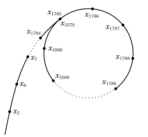

---
# Front matter
title: "Математические основы защиты информации и информационной безопасности. Лабораторная работа №6"
subtitle: "Разложение чисел на множители"
author: |
 Студент: Масолова Анна Олеговна НФИмд-02-21  
 Преподаватель: Кулябов Дмитрий Сергеевич

# Generic otions
lang: ru-RU
toc-title: "Содержание"

# Bibliography
bibliography: bib/cite.bib
csl: pandoc/csl/gost-r-7-0-5-2008-numeric.csl

# Pdf output format
toc: true # Table of contents
toc_depth: 2
lof: true # List of figures
lot: true # List of tables
fontsize: 12pt
linestretch: 1.5
papersize: a4
documentclass: scrreprt
## I18n
polyglossia-lang:
  name: russian
  options:
	- spelling=modern
	- babelshorthands=true
polyglossia-otherlangs:
  name: english
### Fonts
mainfont: PT Serif
romanfont: PT Serif
sansfont: PT Sans
monofont: PT Mono
mainfontoptions: Ligatures=TeX
romanfontoptions: Ligatures=TeX
sansfontoptions: Ligatures=TeX,Scale=MatchLowercase
monofontoptions: Scale=MatchLowercase,Scale=0.9
## Biblatex
biblatex: true
biblio-style: "gost-numeric"
biblatexoptions:
  - parentracker=true
  - backend=biber
  - hyperref=auto
  - language=auto
  - autolang=other*
  - citestyle=gost-numeric
## Misc options
indent: true
header-includes:
  - \linepenalty=10 # the penalty added to the badness of each line within a paragraph (no associated penalty node) Increasing the value makes tex try to have fewer lines in the paragraph.
  - \interlinepenalty=0 # value of the penalty (node) added after each line of a paragraph.
  - \hyphenpenalty=50 # the penalty for line breaking at an automatically inserted hyphen
  - \exhyphenpenalty=50 # the penalty for line breaking at an explicit hyphen
  - \binoppenalty=700 # the penalty for breaking a line at a binary operator
  - \relpenalty=500 # the penalty for breaking a line at a relation
  - \clubpenalty=150 # extra penalty for breaking after first line of a paragraph
  - \widowpenalty=150 # extra penalty for breaking before last line of a paragraph
  - \displaywidowpenalty=50 # extra penalty for breaking before last line before a display math
  - \brokenpenalty=100 # extra penalty for page breaking after a hyphenated line
  - \predisplaypenalty=10000 # penalty for breaking before a display
  - \postdisplaypenalty=0 # penalty for breaking after a display
  - \floatingpenalty = 20000 # penalty for splitting an insertion (can only be split footnote in standard LaTeX)
  - \raggedbottom # or \flushbottom
  - \usepackage{float} # keep figures where there are in the text
  - \floatplacement{figure}{H} # keep figures where there are in the text
---

# Цель работы

Изучение алгоритма разложения составного числа на множители.

# Задачи

Реализовать программно алгоритм, реализующий p-метод Полларда.

# Теоретические сведения

Любое натуральное число n > 1 можно представить в виде произведения простых чисел. Это представление называется разложением числа n на простые множители. [@razlozhenie]

Р-алгоритм Полларда строит числовую последовательность, элементы которой образуют цикл, начиная с некоторого номера n, что может быть проиллюстрировано, расположением чисел в виде греческой буквы p, что послужило названием семейству алгоритмов. Иллюстрацию этого алгоритма на плоскости можно увидеть на рис. [-@fig:001]

{ #fig:001 width=70% height=70%}

## Р-метод Полларда

* Вход. Число $n$, начальное значение $c$, функция $f$, обладающая сжимающими свойствами.
* Выход. Нетривиальный делитель числа $n$.

1. Положить $a=c, b=c$
2. Вычислить $a=f(a)(mod n), b=f(b)(mod n)$
3. Найти $d=НОД(a-b, n)$
4. Если 1 < $d$ < $n$, то положить $p=d$ и результат: $p$. При $d=n$ результат: "Делитель не найден"; при $d=1$ вернуться на шаг 2.

Подробнее об алгоритме: [@pollard]

# Выполнение работы

## Реализация алгоритмов

```
def euclid(a, b):
    r = []
    r.append(a)
    r.append(b)
    i = 1
    while True:
        r.append(r[i - 1] % r[i])
        if r[i + 1] == 0:
            d = r[i]
            return d
        else:
            i = i + 1


def pollard(n, c):
    a = c
    b = c
    while True:
        a = f(a, n) % n
        b = f(f(b, n), n) % n
        first = min(a - b, n)
        second = max(a - b, n)
        d = euclid(first, second)
        if d > 1 and d < n:
            p = d
            return p
        elif d == n:
            return -1
        elif d == 1:
            continue


def f(x, n):
    return (x ** 2) + 5 % n


n = int(input("Введите число n: "))
c = int(input("Введите число c: "))
result = pollard(n, c)
print("Нетривиальный делитель числа n = {}".format(result))

```

## Пример работы p-метода Полларда

На рис. [-@fig:002] представлены результаты работы p-метода Полларда: 

{ #fig:002 width=70% height=70%}

# Выводы

В ходе выполнения работы был успешно изучен p-метод Полларда, а также был реализован программно программно на языке Python.

# Список литературы{.unnumbered}

::: {#refs}
:::